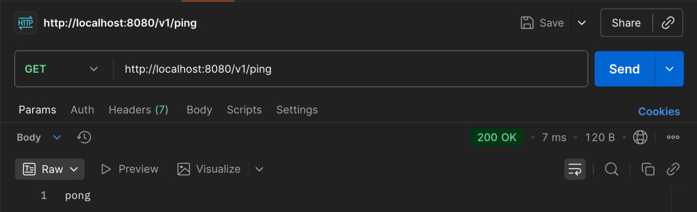
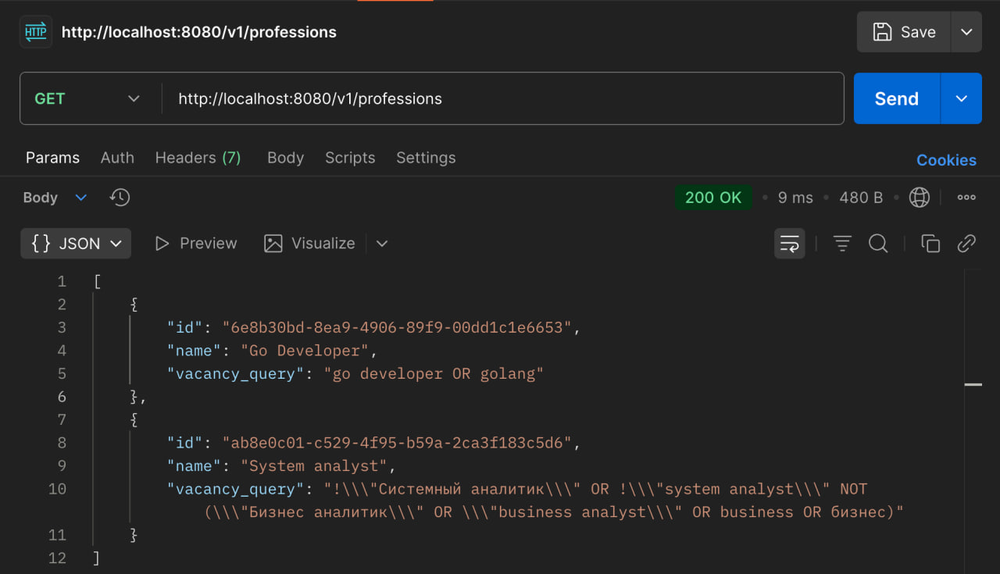
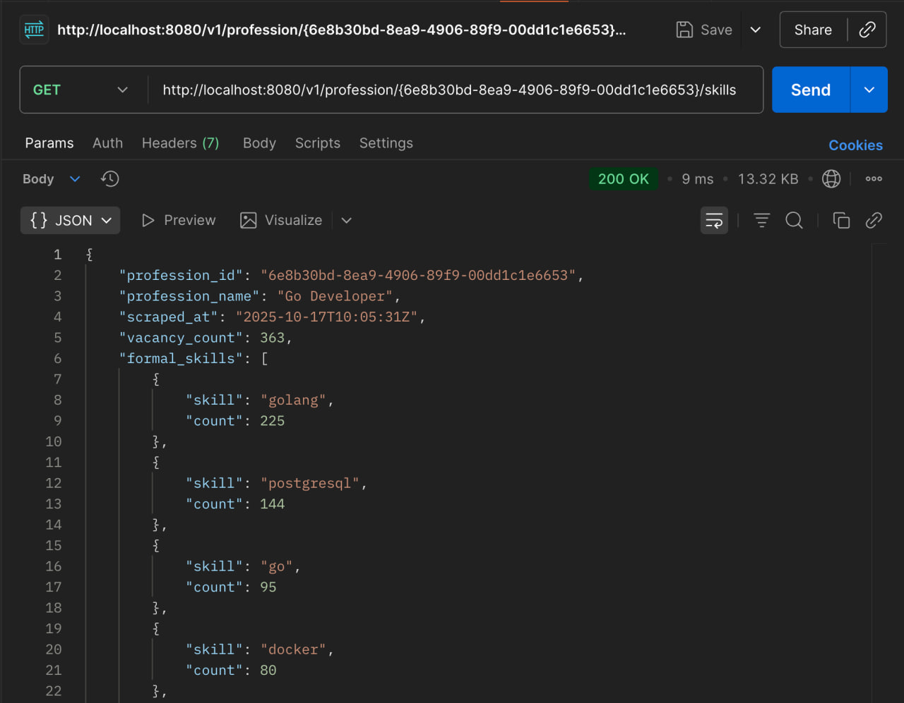
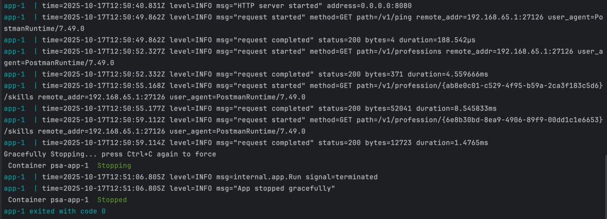

## PSA - Professional Skills Analyzer

Система для анализа востребованных навыков по профессиям на основе данных hh.ru API.

*Проект на стадии MVP*

### О проекте

Сервис для сбора и анализа требований к соискателям. Система автоматически собирает данные с hh.ru, извлекает ключевые
навыки из вакансий и предоставляет актуальные требования на рынке труда.

### Ключевые возможности

- **Сбор данных** с hh.ru API с авторизацией OAuth 2.0
- **Извлечение навыков:** формальные навыки из поля "ключевые навыки" и неявные навыки из описания вакансии с помощью
алгоритма [n-gram](https://en.wikipedia.org/wiki/N-gram)
- **REST API** для доступа к агрегированным данным
- **Автоматическое обновление данных** по расписанию

### Стек

- **Backend**: Go, стандартный net/http

- **БД**: PostgreSQL, драйвер pgx

- **Миграции**: [migrate](github.com/golang-migrate/migrate/v4 v4.18.3)

- **Генерация SQL**: [sqlc](https://github.com/sqlc-dev/sqlc)

- **Конфигурация**: [cleanenv](github.com/ilyakaznacheev/cleanenv)

- **Контейнеризация**: Docker & Docker Compose

- **Rate limiter**: встроенный лимитер для HH API (допустимо 5 запросов в секунду)

- **Retry**: Equal Jitter

- **Шаблон**: [evrone/go-clean-template](https://github.com/evrone/go-clean-template/tree/master)

### Как это работает

- **Сбор вакансий** по запросу для каждой профессии
- **Анализ формальных навыков**
- **Извлечение неявных навыков** из описания вакансий
- **Агрегация статистики** по частоте упоминаний
- **Сохранение данных в БД**
- **Предоставление данных** через REST API

### Запуск

Для запуска необходимы: docker и docker compose

Зарегистрировать приложение в [HeadHunter API](https://dev.hh.ru/)

Клонировать репозиторий

Создать файл .env по примеру .env.example

Запуск PostgreSQL: `make postgres-up`

Применение миграций БД: `make migrate-up`

В БД заранее не заданы профессии, поэтому можно подключиться к БД и добавить профессии:

`docker compose exec postgres psql -U psalocal -d psalocal`

`insert into profession (name, vacancy_query, is_active) values
('Go Developer', 'go developer OR golang', true),
('System analyst', '!\"Системный аналитик\" OR !\"system analyst\" NOT (\"Бизнес аналитик\" OR \"business analyst\" OR business OR бизнес)', true);
`

Запуск приложения: `make up`

### API

##### Health check
`GET http://localhost:8080/v1/ping`

##### Список профессий

`GET http://localhost:8080/v1/professions`

##### Получить последние собранные навыки для профессии (id из прошлого запроса)

Данные в отсортированном виде от больше количества упоминаний к меньшему

`GET http://localhost:8080/v1/profession/{id}/skills`

##### Логи приложения

