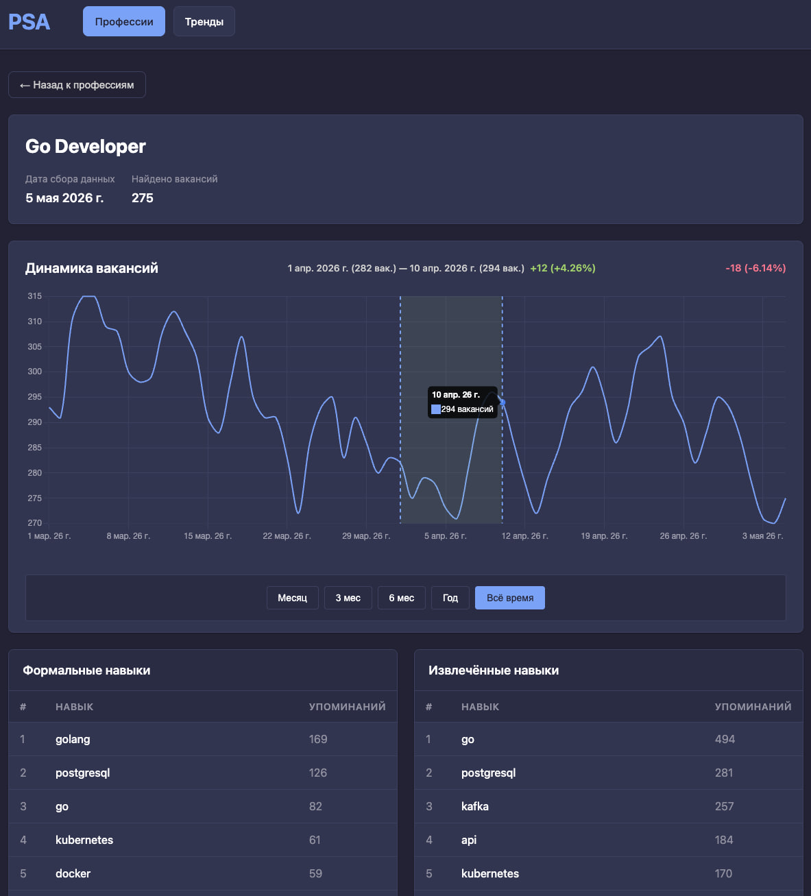
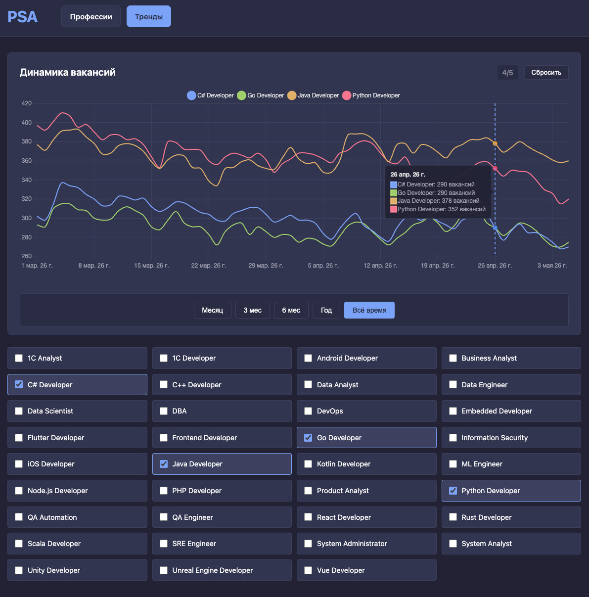
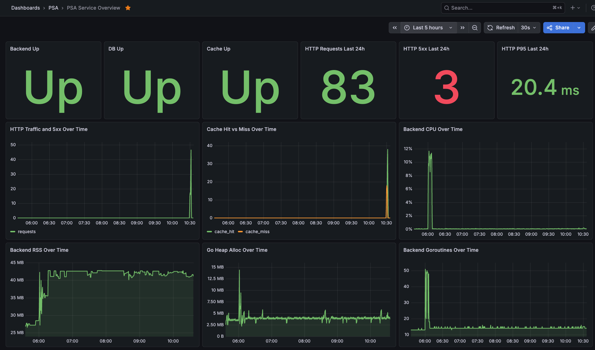

# PSA - Professional Skills Analyzer

Сервис для анализа востребованных профессиональных навыков на основе данных hh.ru API.

*Проект на стадии MVP*

## Оглавление

- [О проекте](#about)
- [Что умеет сервис](#features)
- [Стек](#stack)
- [Как это работает](#how-it-works)
- [Frontend](#frontend)
- [Запуск](#run)
- [Observability](#observability)
- [Документация](#docs)

<a id="about"></a>
## О проекте

PSA автоматически собирает вакансии по заданным профессиям, извлекает требования к соискателям и агрегирует
статистику по навыкам.

Источником данных является hh.ru API.
Результаты доступны через REST API.

<a id="features"></a>
## Что умеет сервис

- Интеграция с hh.ru API (OAuth 2.0)
- Сбор вакансий с hh.ru API по заранее заданным профессиям
- Извлечение ключевых навыков из вакансий
- Поиск неявных навыков в описаниях вакансий с помощью алгоритма [n-gram](https://en.wikipedia.org/wiki/N-gram) на основе ключевых навыков
- Агрегация навыков по частоте упоминаний
- Отслеживание динамики количества вакансий
- REST API для получения данных
- Административное API для управления профессиями и ручного запуска сбора данных
- Аутентификация и авторизация JWT для администратора
- Автоматический сбор данных по расписанию

<a id="stack"></a>
## Стек

- Backend: Go, стандартный net/http, slog
- Reverse proxy: Caddy
- БД: PostgreSQL (pgx)
- Кэш: Redis
- Observability: Grafana, Prometheus, Loki, Alloy
- Миграции: [golang-migrate](https://github.com/golang-migrate/migrate)
- Генерация SQL: [sqlc](https://github.com/sqlc-dev/sqlc)
- Конфигурация: [cleanenv](https://github.com/ilyakaznacheev/cleanenv)
- Контейнеризация: Docker & Docker Compose
- Background jobs: [gocron](https://github.com/go-co-op/gocron)
- Retry strategy для hh.ru API: Equal Jitter
- Тестирование: unit/integration tests, [testcontainers-go](https://github.com/testcontainers/testcontainers-go)
- Генерация моков: [mockery](https://github.com/vektra/mockery)
- Линтинг: [golangci-lint](https://github.com/golangci/golangci-lint)

Многие вещи в проекте можно было сделать проще, но я сознательно сделал его шире, чтобы на практике разобраться с разными частями backend-разработки.


<a id="how-it-works"></a>
## Как это работает

- Для каждой профессии хранится поисковый запрос
- По расписанию или вручную запускается сбор вакансий с hh.ru API
- Из вакансий извлекаются ключевые навыки и навыки из текста описаний
- Найденные навыки агрегируются по частоте упоминаний
- Результаты сохраняются в Redis и PostgreSQL в зависимости от сценария сбора и назначения данных
- Обработанные данные доступны через REST API

<a id="frontend"></a>
## Frontend

Для проекта есть отдельный frontend-клиент: [psa-front](https://github.com/Winxfly/psa-front).



<details>
<summary>Сравнение профессий</summary>



</details>

<a id="run"></a>
## Запуск

Для запуска необходимы: Docker, Docker Compose и Make.

Зарегистрировать приложение в [HeadHunter API](https://dev.hh.ru/) (необязательно для запуска, но сбор данных будет недоступен).

Клонировать репозиторий:

```bash
git clone https://github.com/Winxfly/psa.git
```

Перейти в директорию проекта:

```bash
cd psa
```

Создать файл `.env` по примеру `.env.example` и модифицировать, следуя инструкциям в комментариях файла:

```bash
cp .env.example .env
```

> Наличие `.env` файла обязательно, иначе намеренное падение при старте сервиса.

> Для локального запуска и ограниченной проверки этого достаточно. Если не указать ключи HH API, сбор данных будет недоступен.

Далее варианты запуска:

- [Local development](docs/local-development.md)
- [Production](docs/production.md)

<a id="observability"></a>
## Observability

В проекте есть observability stack: Prometheus, Grafana, Loki и Alloy.



Подробнее: [Observability](docs/observability.md)

<a id="docs"></a>
## Документация

- [Local development](docs/local-development.md)
- [Production](docs/production.md)
- [API examples](docs/api.md)
- [Observability](docs/observability.md)
- [Makefile commands](Makefile)
