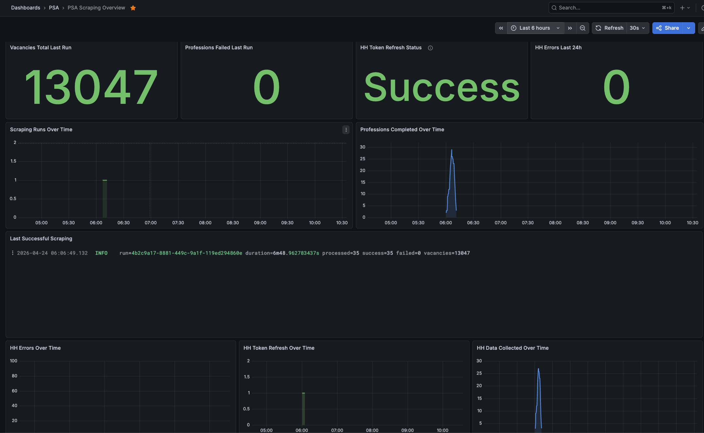

# Observability

Набор инструментов для мониторинга backend-сервиса, инфраструктуры и процесса сбора данных.

В проекте используются Prometheus, Grafana, Loki и Alloy.

## Оглавление

- [Stack](#stack)
- [Dashboards](#dashboards)
- [Local access](#local-access)
- [Production access](#production-access)
- [Logs](#logs)
- [Troubleshooting](#troubleshooting)

<a id="stack"></a>
## Stack

- Prometheus - собирает и хранит метрики
- Grafana - показывает dashboards
- Loki - хранит logs
- Alloy - читает Docker logs и отправляет их в Loki

<a id="dashboards"></a>
## Dashboards

В Grafana автоматически добавляются два dashboard:

- `PSA Service Overview`
- `PSA Scraping Overview`

### Service Overview

Dashboard для общего состояния backend-сервиса.

Показывает:

- доступность backend, PostgreSQL и Redis
- количество HTTP requests
- количество HTTP 5xx
- HTTP P95 latency
- cache hit, miss и get failed
- CPU, RSS, heap и goroutines backend-контейнера


### Scraping Overview

Dashboard для процесса сбора данных с hh.ru.

Показывает:

- вакансии и ошибки профессий в последнем scraping run
- статус последнего обновления HH token
- количество HH API errors за последние 24 часа
- динамику scraping runs
- динамику успешно обработанных профессий
- summary последнего успешного scraping run
- динамику ошибок HH API
- динамику refresh-событий HH token
- динамику собранных данных по профессиям

`No recent refresh` в token panel означает, что в выбранном time range не было финальных событий обновления token или обновление токена давно не требуется (он долгоживущий).



<a id="local-access"></a>
## Local access

Если нужен полный local stack:

```bash
make full-up
```

Если backend уже запущен и нужно поднять только observability:

```bash
make obs-up
```

Локальные адреса по умолчанию:

- Grafana: `http://localhost:3001`
- Prometheus: `http://localhost:9090`
- Loki: `http://localhost:3100`

Grafana credentials берутся из `.env`:

- `GRAFANA_ADMIN_USER`
- `GRAFANA_ADMIN_PASSWORD`

Если host-порты изменены в `.env`, адреса тоже изменятся.

<a id="production-access"></a>
## Production access

В production compose observability stack поднимается вместе с backend-инфраструктурой:

```bash
make prod-up
```

Grafana, Prometheus и Loki не публикуются наружу. Grafana и Prometheus доступны только на localhost сервера:

- Grafana: `127.0.0.1:${GRAFANA_HOST_PORT:-3001}`
- Prometheus: `127.0.0.1:${PROMETHEUS_HOST_PORT:-9090}`

Для доступа с локальной машины используется SSH tunnel.

Grafana:

```bash
ssh -L 3001:localhost:3001 <user>@<server>
```

После подключения: `http://localhost:3001`

Prometheus:

```bash
ssh -L 9090:localhost:9090 <user>@<server>
```

После подключения: `http://localhost:9090`

Loki обычно не нужно открывать напрямую: Grafana использует его как datasource внутри Docker network.

<a id="logs"></a>
## Logs

Backend пишет структурированные JSON logs в `dev` и `prod` режимах.

Alloy читает Docker logs и отправляет их в Loki.

Grafana dashboards используют Loki queries по JSON-полям логов.

<a id="troubleshooting"></a>
## Troubleshooting

Если dashboard показывает `No data`, сначала проверь:

- выбранный time range в Grafana
- backend контейнер пишет нужные logs
- Alloy запущен
- Loki datasource в Grafana доступен
- Prometheus targets находятся в состоянии `UP`